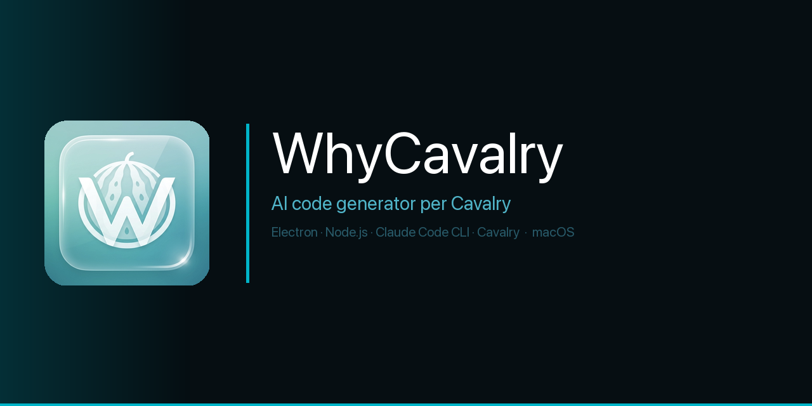
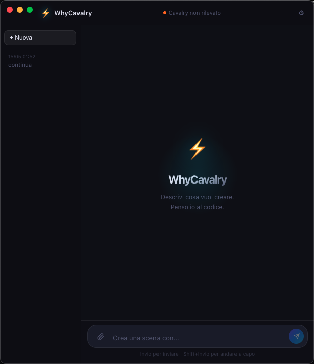

<p align="center">
  
</p>

<p align="center">
  <a href="https://github.com/OfficialWhyEd/WhyCavalry/stargazers"></a>
  <a href="https://discord.gg/cQQckfnN"></a>
  <a href="https://instagram.com/whyed.music"></a>
  <a href="https://officialwhyed.github.io/WhyCavalry"></a>
</p>

<p align="center">
  
  
  
  
  
</p>

<br/>

> Describe animation in plain language. WhyCavalry generates the Cavalry JavaScript and fires it live in your open scene via AppleScript. **Zero copy-paste. Zero context switching.**

---

## Philosophy

**Zero copy-paste** — The standard workflow: write in ChatGPT → copy → switch to Cavalry → paste in Scripts → run. WhyCavalry eliminates every step after the first sentence. The file bridge writes to `~/.whycavalry/`, AppleScript triggers Cavalry's Scripts menu, the animation runs — while you are still looking at the chat.

**Cavalry native** — Claude knows the full Cavalry.js API: shapes, modifiers, expressions, connectors, timing functions. Not a wrapper around generic code generation. It generates Cavalry-idiomatic scripts that work on first run.

**Conversation memory** — The sidebar stores all sessions. "Make it 30% faster" works because Claude has the previous script in context. Iterative motion design without re-describing from scratch.

**Zero API cost** — Claude Code CLI runs on a Claude Pro subscription. No API key. No per-request billing. Use it all day for every animation.

---

## How it works

```
Chat UI → Claude Code CLI → bridge file → Cavalry (Scripts menu)
                ↑
         current scene context
```

| Layer | Description |
|-------|-------------|
| **UI** | Electron chat app, dark, conversation sidebar |
| **AI** | Claude Code CLI — knows full Cavalry.js API |
| **Bridge** | File bridge `~/.whycavalry/` + osascript trigger |
| **Cavalry** | Executes the generated script via Scripts menu |

---

<p align="center">
  
</p>

---

## What you can describe

| Describe | What runs |
|---------|----------|
| "Circles exploding from center, pastel colors, infinite loop" | Particle emitter with radial velocity + color array + loop |
| "Text 'Hello' entering with spring physics from the left" | Text layer, spring easing on X, overshoot and settle |
| "Smooth morph between circle and square, 2 seconds" | Shape morph modifier, ease in/out, seamless loop |
| "Background shifting from teal to black, sinusoidal" | Color animation with sine expression on background layer |
| "Duplicate the main layer and rotate it 45° every frame" | Layer duplication + rotation expression |
| "Make it 30% faster and add a white flash on impact" | Claude reads previous script, modifies timing, adds flash overlay |

---

## Why this is different

| | WhyCavalry | AI + copy-paste | Manual Cavalry scripting |
|--|-----------|----------------|------------------------|
| Copy-paste required | Never | Every time | N/A |
| Context switching | None | Constant | N/A |
| Iteration speed | Under 3s | 30–60s | Minutes |
| Cavalry API coverage | Full | Generic | Full |
| Conversation memory | Yes | No | N/A |

---

## Stack

- **App**: Electron + Node.js
- **UI**: HTML/CSS/JS native renderer
- **AI**: Claude Code CLI (`claude --print`)
- **Bridge**: File system + AppleScript → Cavalry Scripts menu
- **Prerequisite**: Cavalry installed + Claude Code authenticated

---

## Setup

```bash
git clone https://github.com/OfficialWhyEd/WhyCavalry
cd WhyCavalry

npm install
npm start

# or
open /Applications/WhyCavalry.app
```

Cavalry must be open with an active scene.

---

## Structure

```
WhyCavalry/
├── electron-main.js   # Electron main process
├── preload.js         # Secure bridge renderer ↔ main
├── renderer/          # Chat UI
├── app.js             # AI pipeline + file bridge
└── cavalry-scripts/   # Predefined Cavalry scripts
```

---

## Star History

[](https://star-history.com/#OfficialWhyEd/WhyCavalry&Date)

---

## Spread the word

- **Discord** — [discord.gg/cQQckfnN](https://discord.gg/cQQckfnN)
- **Instagram** — [@whyed.music](https://instagram.com/whyed.music)
- **Reddit** — [r/motiondesign](https://reddit.com/r/motiondesign), [r/LocalLLaMA](https://reddit.com/r/LocalLLaMA)

---

## Contributing

Pull requests welcome.

- **Windows port** — replace AppleScript with a cross-platform trigger
- **Cavalry script library** — predefined high-quality animations
- **Better context injection** — feed current scene state to Claude

---

<p align="center">Built by <a href="https://github.com/OfficialWhyEd">@whyed</a> · macOS · Cavalry + Claude · <a href="https://officialwhyed.github.io/WhyCavalry">website</a> · MIT License</p>
